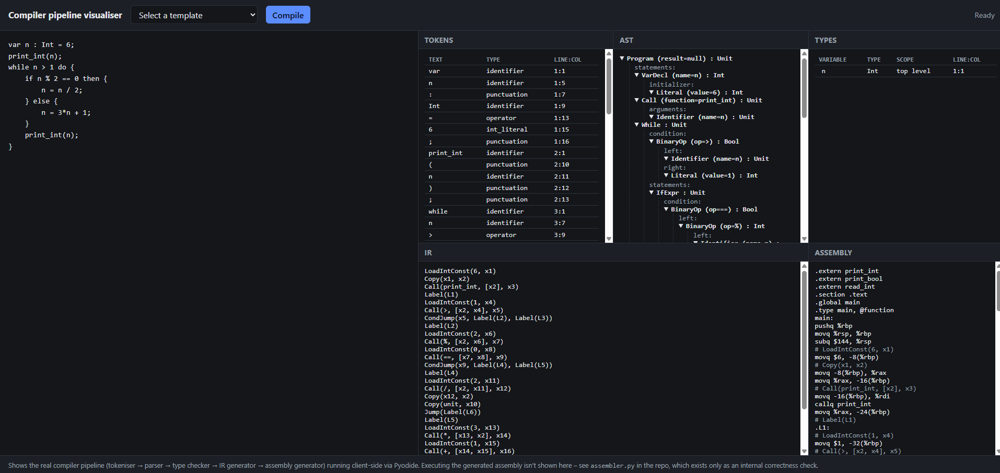

# compilers-project

A hand-written compiler, in Python, with no parser-generator libraries (no ANTLR/PLY/lark) — every stage is
implemented from scratch:

```
source text → tokeniser → recursive-descent parser → type checker → IR generator → x86-64 assembly
```

It compiles a small statically-typed expression language (variables, `if`/`while`, blocks, arithmetic/boolean
operators, `print_int`/`print_bool`/`read_int`) down to real, runnable GNU-syntax x86-64 assembly. See
[`language_spec.md`](language_spec.md) for the full language grammar and semantics.

## Try it online

**[Pipeline visualiser →](https://ethkatzy.github.io/compilers-project/)**




A static page that runs the real compiler client-side in the browser (via [Pyodide](https://pyodide.org/),
CPython compiled to WebAssembly - no backend, nothing installed). Type or pick an example program and see all
five stages update live:

- **Tokens** - the output of the tokeniser
- **AST** - the parsed syntax tree, as collapsible nodes
- **Type checking** - the types of the variables
- **IR** - the intermediate representation 
- **Assembly** - the generated x86-64 text

Errors from any stage are shown inline with a "jump to location" link back into the source. Actually assembling,
linking, and running the generated assembly is intentionally not part of the demo (see [Architecture](#architecture)
below). The visualiser shows the generated code, but it doesn't execute it.

The site is rebuilt and redeployed automatically (via `.github/workflows/deploy-pages.yml`) on every push to
`main` that touches `frontend/` or `src/compiler/`.

## Architecture

| Stage              | Module | Notes                                                                                                                                                                     |
|--------------------|---|---------------------------------------------------------------------------------------------------------------------------------------------------------------------------|
| Tokeniser          | `src/compiler/tokenizer.py` | Source text → `Token` list                                                                                                                                                |
| Parser             | `src/compiler/parser.py` | Recursive-descent, `Token` list → AST (`src/compiler/astree.py`)                                                                                                          |
| Type checker       | `src/compiler/type_checker.py` | Walks the AST, checks types, raises on the first type error                                                                                                               |
| IR generator       | `src/compiler/ir_generator.py` | AST → a linear intermediate representation (`src/compiler/ir.py`);                                                                                                        |
| Assembly generator | `src/compiler/assembly_generator.py` | IR → x86-64 GNU-syntax assembly text (Linux target)                                                                                                                       |
| Assembler          | `src/compiler/assembler.py` | *Internal correctness check only* - shells out to real `as`/`ld` to prove the generated assembly actually assembles, links, and runs. Not part of any public entry point. |

There is no CLI or `main()` — the pipeline is a set of plain functions you call directly (see
[Using the pipeline directly](#using-the-pipeline-directly) below).

## Worked example

What each stage actually produces, for this source:

```
var x = 1 + 2 * 3;
print_int(x);
```

<details>
<summary><strong>Tokens</strong></summary>

```
Token(text='var', type='identifier', location=Location(line=1, column=1))
Token(text='x', type='identifier', location=Location(line=1, column=5))
Token(text='=', type='operator', location=Location(line=1, column=7))
Token(text='1', type='int_literal', location=Location(line=1, column=9))
Token(text='+', type='operator', location=Location(line=1, column=11))
Token(text='2', type='int_literal', location=Location(line=1, column=13))
Token(text='*', type='operator', location=Location(line=1, column=15))
Token(text='3', type='int_literal', location=Location(line=1, column=17))
Token(text=';', type='punctuation', location=Location(line=1, column=18))
Token(text='print_int', type='identifier', location=Location(line=2, column=1))
Token(text='(', type='punctuation', location=Location(line=2, column=10))
Token(text='x', type='identifier', location=Location(line=2, column=11))
Token(text=')', type='punctuation', location=Location(line=2, column=12))
Token(text=';', type='punctuation', location=Location(line=2, column=13))
```

</details>

<details>
<summary><strong>AST</strong></summary>

The `type` shown on each node is assigned structurally by the parser itself (e.g. `+` is always typed `Int`,
`==` always `Bool`) but it's not yet validated. `type_check` is the pass that actually checks these are consistent
(e.g. that both operands of `+` really are `Int`) and raises on the first mismatch; it doesn't mutate the AST.

```
Program (type=Unit, result=None)
  statements:
    VarDecl (type=Int, name='x')
      initializer:
        BinaryOp (type=Int, op='+')
          left:
            Literal (type=Int, value=1)
          right:
            BinaryOp (type=Int, op='*')
              left:
                Literal (type=Int, value=2)
              right:
                Literal (type=Int, value=3)
    Call (type=Unit, function='print_int')
      arguments:
        Identifier (type=Unit, name='x')
```

Note `*` binds tighter than `+`: `2 * 3` is its own subtree nested under the right-hand side of the `+`, even
though `+` appears first in the source.

</details>

<details>
<summary><strong>IR</strong></summary>

```
LoadIntConst(1, x1)
LoadIntConst(2, x2)
LoadIntConst(3, x3)
Call(*, [x2, x3], x4)
Call(+, [x1, x4], x5)
Copy(x5, x6)
Call(print_int, [x6], x7)
```

</details>

<details>
<summary><strong>Assembly</strong></summary>

```asm
.extern print_int
.extern print_bool
.extern read_int
.section .text
.global main
.type main, @function
main:
pushq %rbp
movq %rsp, %rbp
subq $56, %rsp
# LoadIntConst(1, x1)
movq $1, -8(%rbp)
# LoadIntConst(2, x2)
movq $2, -16(%rbp)
# LoadIntConst(3, x3)
movq $3, -24(%rbp)
# Call(*, [x2, x3], x4)
movq -16(%rbp), %rax
imulq -24(%rbp), %rax
movq %rax, -32(%rbp)
# Call(+, [x1, x4], x5)
movq -8(%rbp), %rax
addq -32(%rbp), %rax
movq %rax, -40(%rbp)
# Copy(x5, x6)
movq -40(%rbp), %rax
movq %rax, -48(%rbp)
# Call(print_int, [x6], x7)
movq -48(%rbp), %rdi
callq print_int
movq %rax, -56(%rbp)
movq $0, %rax
movq %rbp, %rsp
popq %rbp
ret
```

</details>

Try this program (or your own) in the [visualiser](https://ethkatzy.github.io/compilers-project/) to see the
same four stages (and type checking) update live.

## Running locally

### Requirements

- [pyenv](https://github.com/pyenv/pyenv) for installing Python 3.12 (pinned in `.python-version`)
- [Poetry](https://python-poetry.org/) for dependency management

### Setup

```sh
pyenv install        # installs the Python version pinned in .python-version
poetry install        # installs dependencies from pyproject.toml
```

### Verify everything works

```sh
./check.sh
```

This runs `mypy` (strict typing), `ruff` (linting), and the `pytest` suite, in that order.
`tests/test_pipeline.py` runs a set of golden programs (drawn from
`language_spec.md`) all the way through tokenise → parse → type-check → IR → assembly and checks the pipeline
completes without error; this tier is portable and always runs.

There's a second, stricter test tier in the same file that actually assembles, links, and *runs* those golden
programs with real `as`/`ld` and checks the real stdout. It's skipped automatically when no Linux toolchain is on
`PATH` (the normal case on plain Windows). To exercise it, run pytest from somewhere with `as`/`ld` available, e.g.
inside WSL:

```sh
wsl -d <distro> -- bash -lc 'cd /mnt/c/path/to/compilers-project && PYTHONPATH=src/compiler poetry run pytest tests/'
```

### Using the pipeline directly

There's no CLI, you call the five stage functions yourself:

```python
import sys
sys.path.insert(0, "src/compiler")  # or: import compiler, which does this for you

from tokenizer import tokenize
from parser import parse
from type_checker import type_check
from ir_generator import generate_ir, GLOBAL_SYMTAB
from assembly_generator import generate_assembly

source = "print_int(1 + 2 * 3);"
tokens = tokenize(source)
ast = parse(tokens)
type_check(ast)  
ir_instructions = generate_ir(GLOBAL_SYMTAB, ast)
assembly = generate_assembly(ir_instructions)

print(assembly)
```

To actually assemble, link, and run the result (requires a Linux `as`/`ld` toolchain, e.g. WSL since this
targets x86-64 Linux):

```python
from assembler import assemble_and_get_executable

path = assemble_and_get_executable(assembly, workdir="/tmp/build")
```

### Running the frontend locally

```sh
poetry run python frontend/build.py   # assembles a deployable copy into _site/
python -m http.server -d _site         # serve it, then open http://localhost:8000
```

`frontend/build.py` is the same script CI uses to build the GitHub Pages deployment, so local and production
builds are identical.

## License

MIT — see [`LICENSE`](LICENSE).
